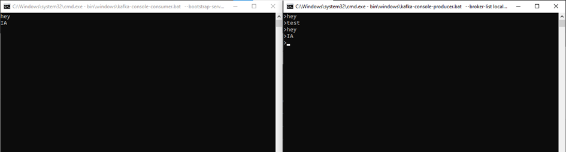
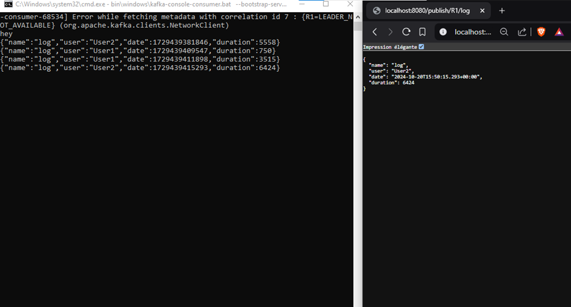
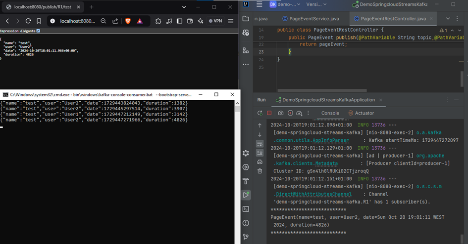
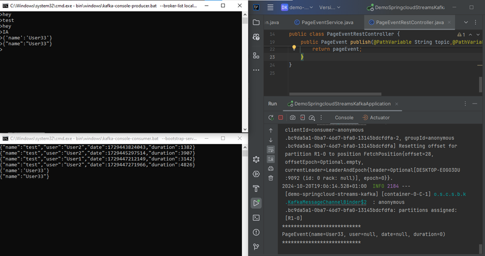
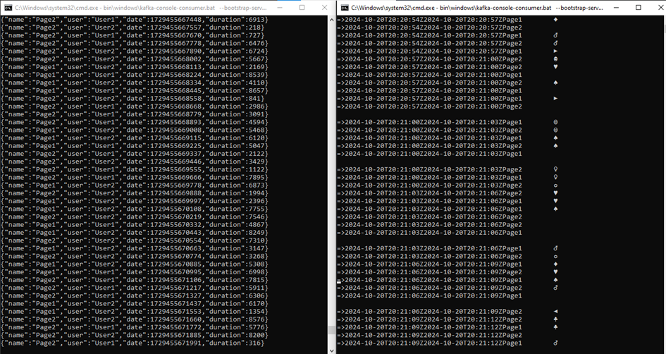
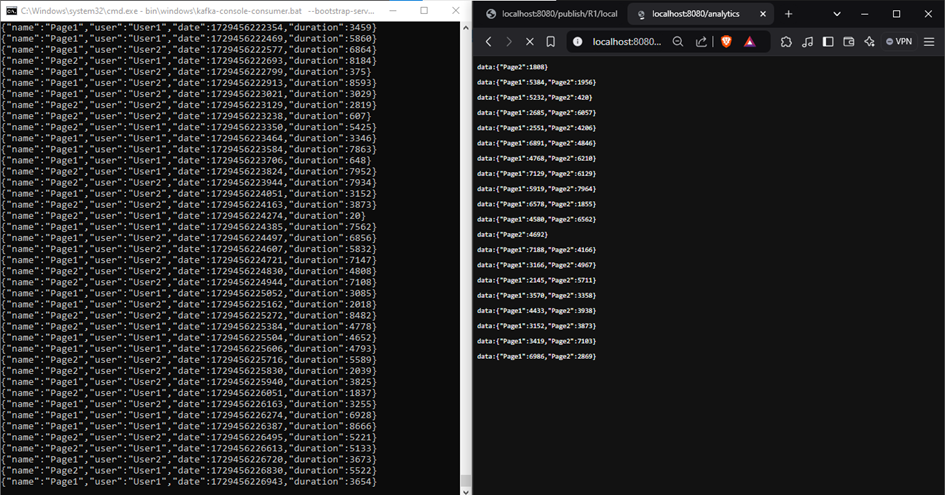
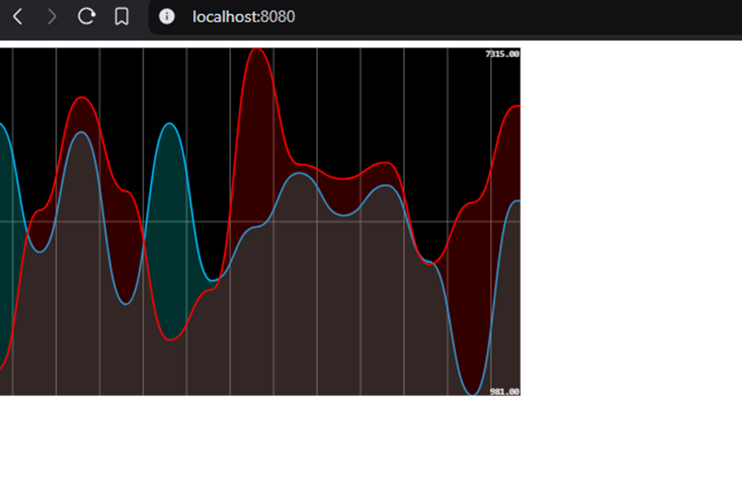

# Event Driben Architecture avec KAFKA

### 1. Tester avec Kafka-console-producer et kafka-console-consumer

### 2. Teser Un Service Producer KAFKA via un Rest Controler

### 3. Tester Un Service Consumer KAFKA via un Rest Controler

### 4. Tester Un Service de Data Analytics Real Time Stream Processing avec Kaflka Streams

### 5. Une application Web qui permet d'afficher les résultats du Stream Data Analytics en temps réel
